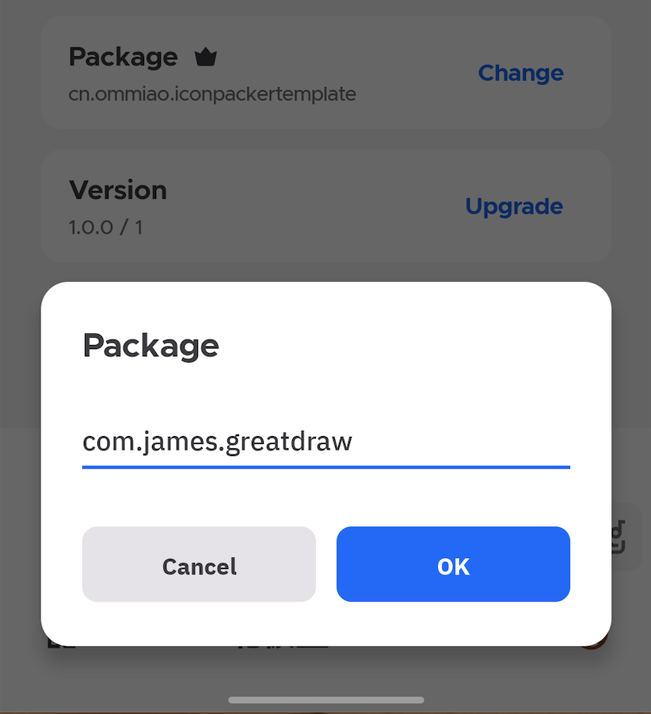
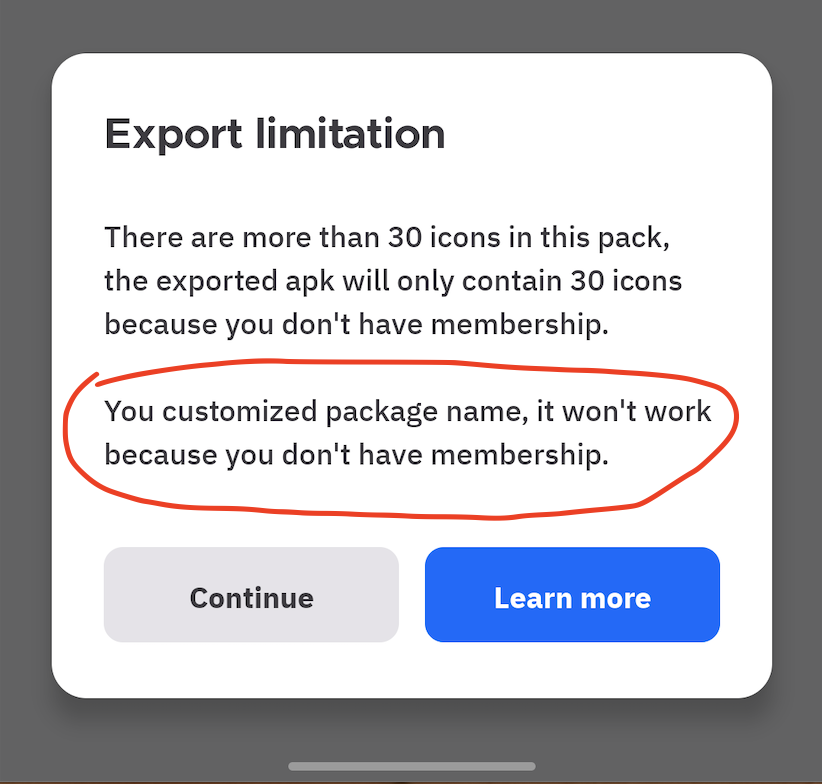

The package name is a identifier of an Android application, each of your installed applications has different package name. If you are trying to install an application with same package name with any installed one, the installed one will be replaced.

Base on that, the default package name of exported icon pack apk is `cn.ommiao.iconpackertemplate`, all of your icon pack projects use same package name, so when you install multiple apks from different projects, they will be replaced each other.

For now there is a new feature that allow you customize package name for each icon pack projects, it's a premium feature, please make sure you have valid subscription.

The package name should be like `aaa0.bbb1.ccc2` format, there can be several parts, each part should start with a alphabet, this is a example:

Feel free to choose any valid package name.

If you customized the package name but no valid subscription, you will get a warning like that:

Enjoy it, any feedbacks please let me know, email: ommiao@foxmail.com!