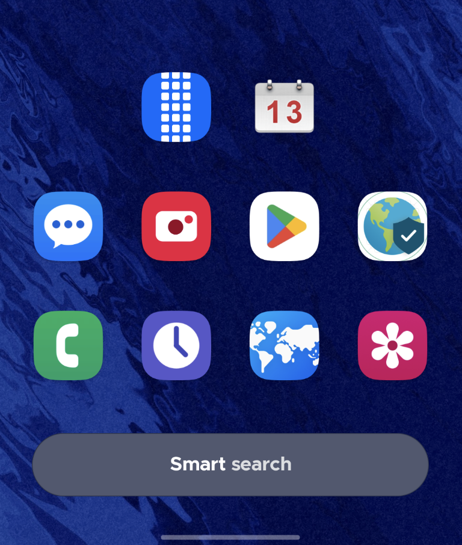
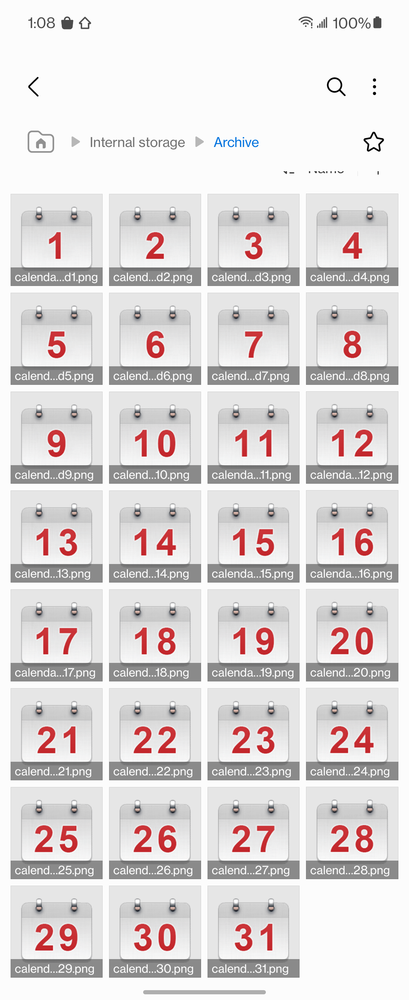
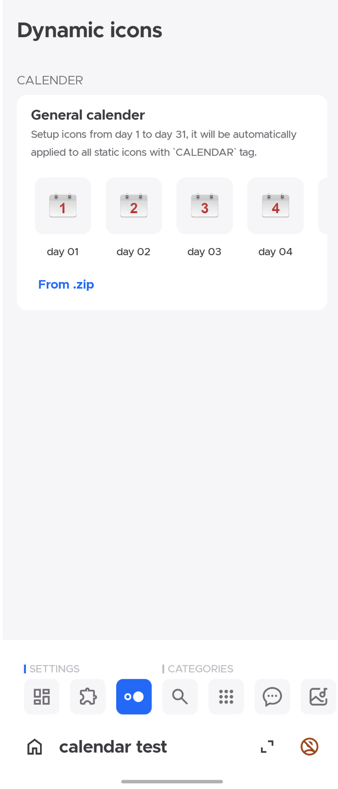
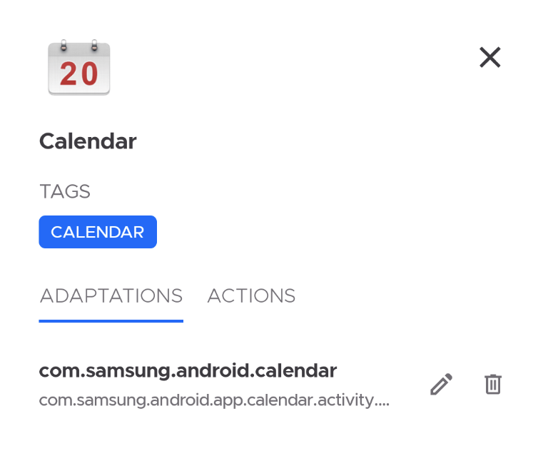

##### What is dynamic calendar?
The dynamic calendar means the icon of your calendar on launcher screen show the date as current real date.
For example, when I edit this article, the date is 13 Dec, so my calendar icon like that:

##### How to implement it?
###### 0. Important information
Not all launchers support dynamic calendar, I use Smart Launcher to test all features. If you meet any issues about dynamic calendar, please test it on different launchers firstly.

###### 1. Prepare calendar resources
We need .png icons of 31 days like that:

And then put all icons in a .zip file with name from 1.png to 31.png.

###### 2. Setup dynamic icons
Open project dynamic icons page, click `From .zip` and then choose that .zip file, you will get all calendar icons in the list. (If you want to change single one, just click that icon and choose a new single icon resource)

###### 3. Mark calendar flag
Don't forget mark your static icons as `calendar`, only icons with `calendar` flag will be applied dynamic icons.
Like that:

###### 4. Build apk and apply
The last thing, export .apk as usual and apply it for your launcher. If no affects please uninstall it and retry to clear the icon pack cache of launcher.