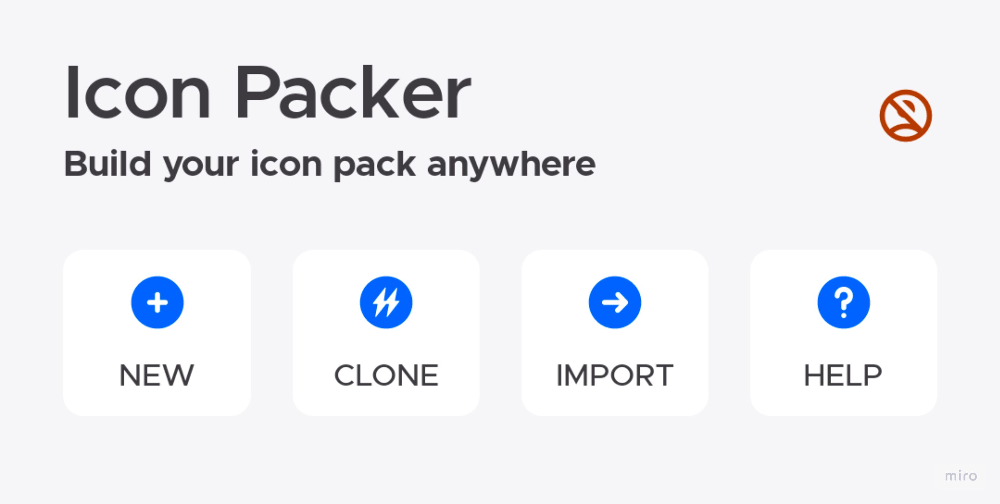
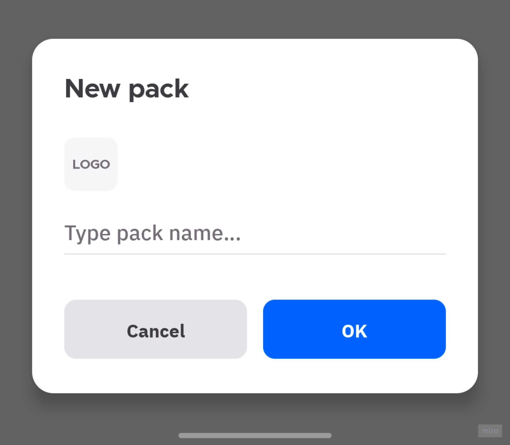
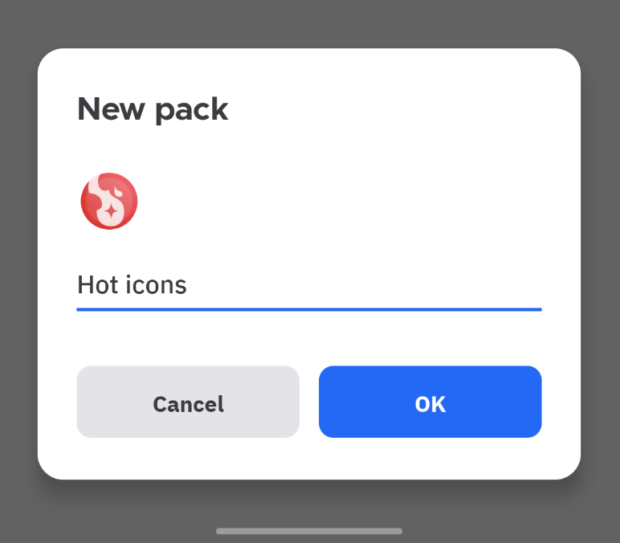
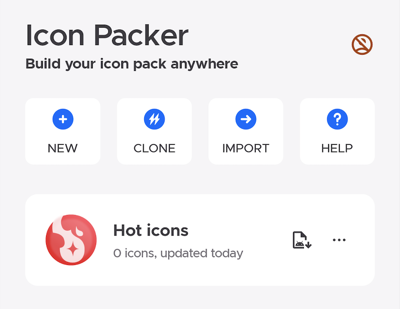
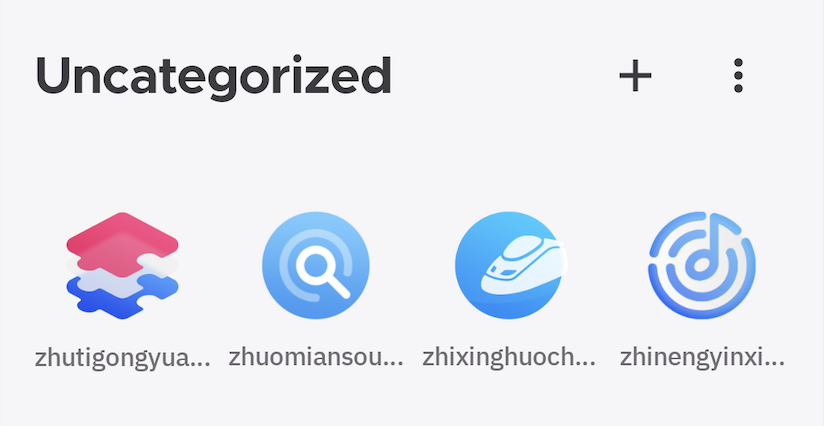
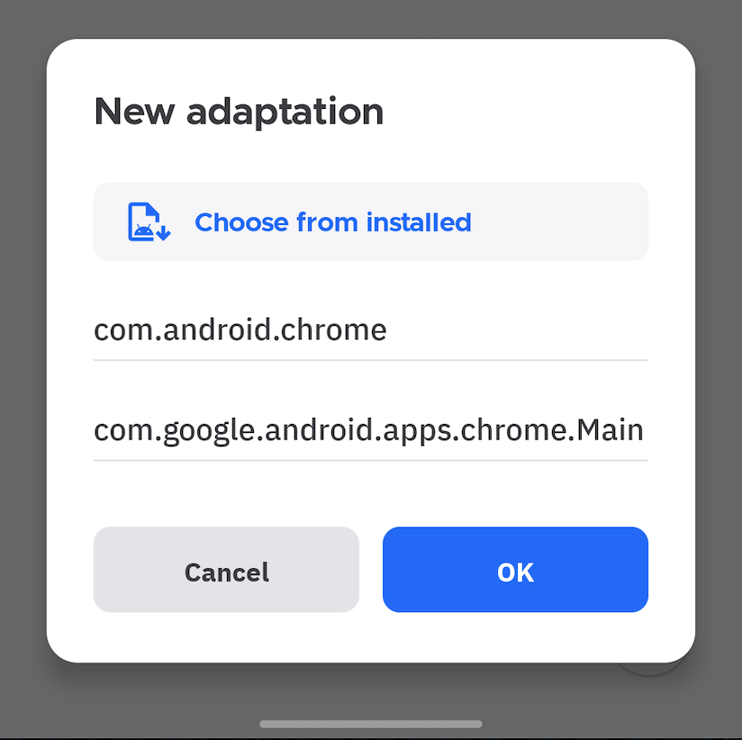
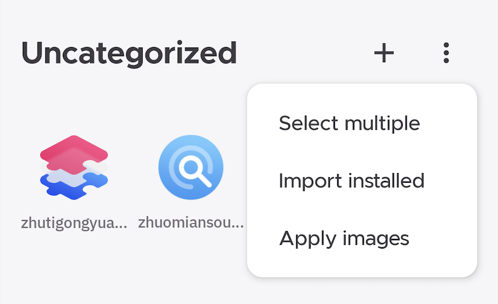
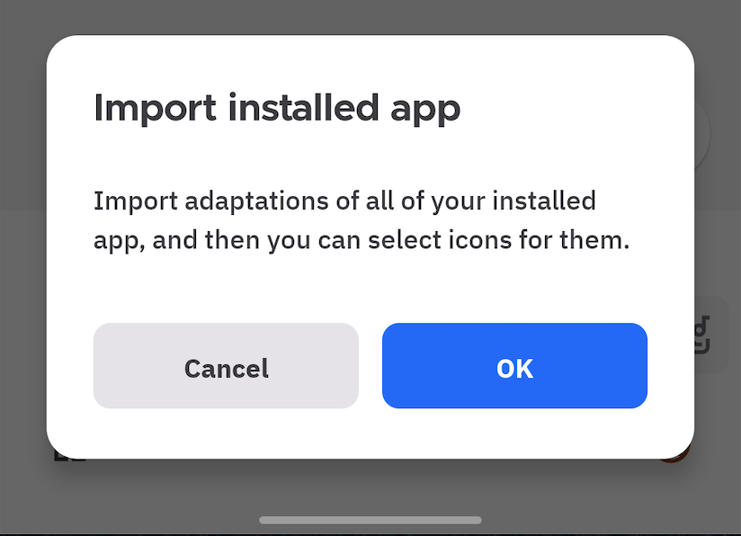
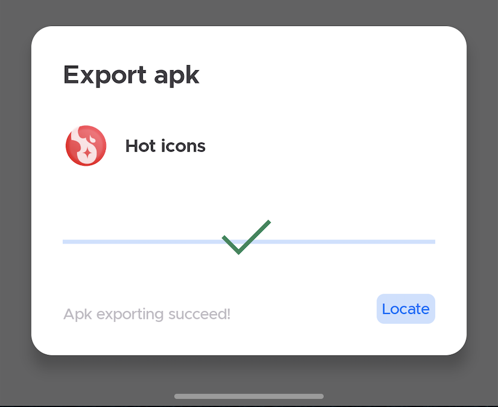

Awesome, you found it! This is the first lesson to build your own icon pack, I promise you'll get your dream icon pack in 10 minutes!

Before we start, I wanna ask you 2 questions.

##### What's the package name or activity name?

Don't worry, it's so easy!

> Package name: an identifier for a specific Android application, it should be unique.
There are some examples:
- Gmail, package name is `com.google.android.gm`
- Twitter, package name is `com.twitter.android`

> Activity name: an entry of the application, usually there are only one activity on your launcher.
There are some examples:
- Gmail, activity name is `com.google.android.gm.ConversationListActivityGmail`
- Twitter, activity name is `com.twitter.android.PostActivity`

##### Why we need the package name and activity name?
> This is a rule of icon pack functionality, the launcher must know which icon should be used for an specific application. So you need to provide those configuration for each icon.

Next, you must prepare your icons resources, make all of them are .png files.

##### 1. Create an icon pack project
Firstly, click `New` action.

Now you get a modal that contains `logo` and `icon pack name field`.

Choose logo and input your icon pack name, like that:

Click `OK`, now you get your first icon pack project!

##### 2. Icons and adaptations
Then let us try to add the icons and adaptations. Click your icon pack project and go to detail page, switch page to categories, there are some built-in categories, you can edit them easily or you can also create your own categories.

###### 1) Add icons
You can click bottom `add` icons button on any categories, and then choose one or multiple .png files.

Now you get all of them in the list, rename them if you needed. Then we must bind icons with your applications, we call it `add adaptations`.

###### 2) Add adaptations
Click any icons, then click bottom `add` adaptations button, now you can import information from installed app or edit it manually.

You can add multiple adaptations for one icon, for example, one calendar icon can be applied to Google calendar, Outlook Calendar or any others.

##### 3. Add batch adaptations(More efficient)

Click `More` button on category page, and select `Import installed`, you will get all adaptation on your list. Then select icons for them.

##### 4. Build icon pack apk
Back to homepage, then click `apk` button on any icon pack item, choose a destination path, just waiting for a minute, you will get your icon pack apk file. 

Click `Locate` to find it! Install and enjoy it.

