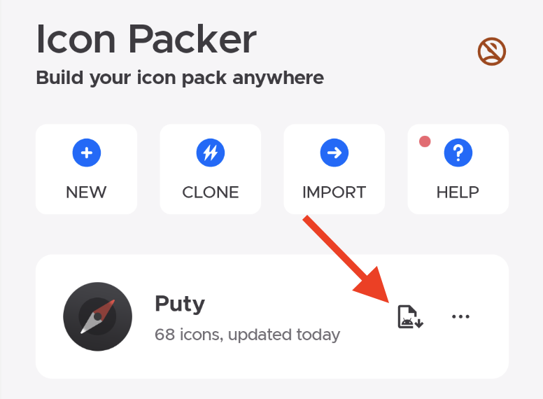

#### Why should we upgrade our icon packs?
As we know, the icon pack is a apk file, that's to say, actually it is an general Android application.
Suppose that you published your icon pack with first version to others, and then you made some changes(such as adding new icons), you need to build your icon pack once more and publish it.

The question is, how to identify your icon packs with different version?

Here are 2 concepts about Android version system.

`Version name`: It's a literal string value for users, like `1.0.0`, `1.1.0` or `1.2.0-beta`, no special rules.
`Version code`: It's a integer value for Android system, like `1`, `2` or `3`, the important rule is it must be increased. For example, if the current version code is 3, the next version code should be larger than 3, otherwise the new exported icon pack CAN NOT be installed successfully. (If you have that case, you must uninstall the old installed icon pack and try to install new one)

#### How to upgrade our icon packs?
##### 1. Check updates for Icon Packer
Since it's a new feature, make sure you are using the latest [Icon Packer](https://play.google.com/store/apps/details?id=cn.ommiao.iconpacker)!

##### 2. Upgrade icon packs
###### 1) Update version of your icon packs
On the icon pack dashboard, click `Upgrade` button, you will get a modal of version upgrading like that:

Update version name and version code, don't forget to make the version code has a increase not a decrease.

###### 2) Export icon packs with new version
Back to homepage, and then click `Export` button to get your icon pack with new version.

Enjoy it!