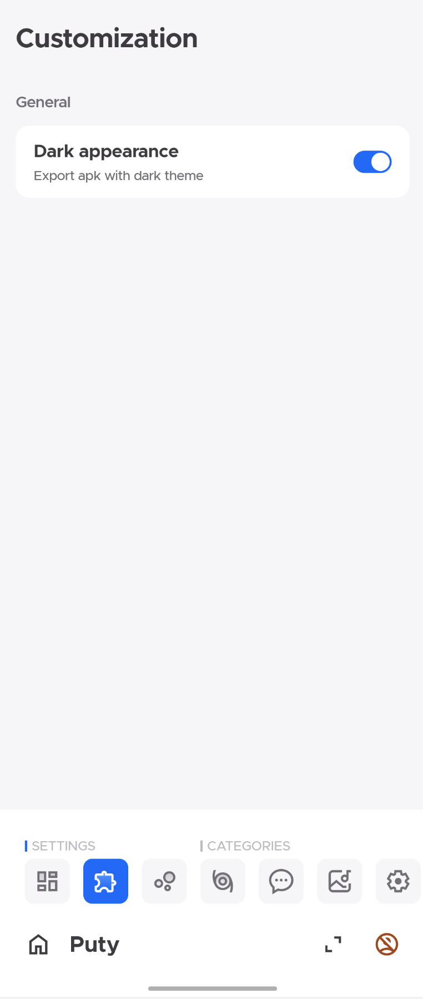
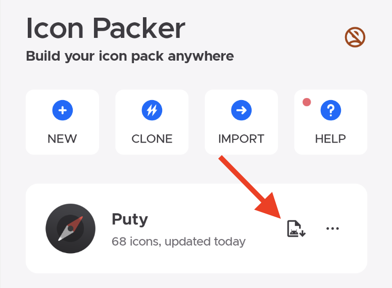
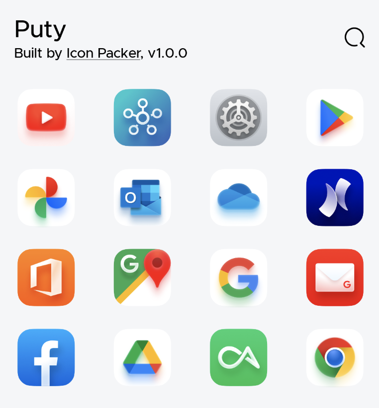
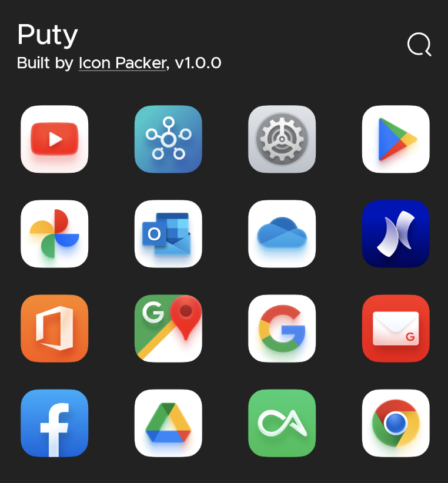

As we known, there are many many icon packs, some are using light colors, some are using dark colors. Maybe sometimes, it will be better if the main appearance of icon pack is dark. That's why I implement this awesome feature!
Make sure you update `Icon Packer` to the latest version!hexo
##### How to enable Dark Appearance
Every icon pack project can choose a proper appearance. The default one is light.

Click any icon pack project to go to the detail page, and then click `Customization` tab like that:

Just enable it, and then export apk again, you will get a new apk with dark appearance! So easy!

##### Showcase
###### Icon pack with light appearance

###### Icon pack with dark appearance
