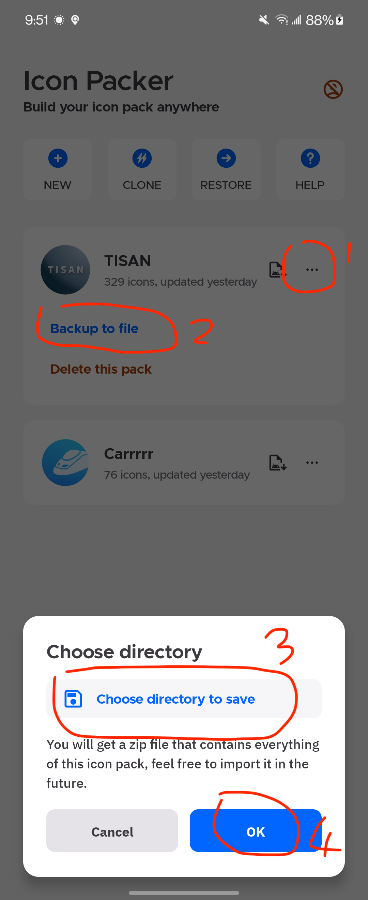
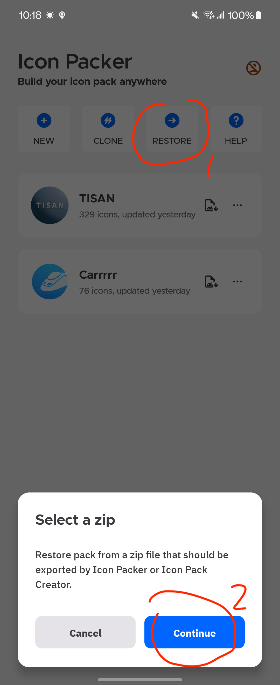

Finally the backup and restore go live! Another exciting news is that you can restore your icon pack project from [Icon Pack Creator](https://play.google.com/store/apps/details?id=cn.ommiao.iconpackcreator).

Learn more about backup and restore!

##### 1. Backup your icon pack project
> As we know, the Icon Packer is a offline tool to build your icon packs, all of your resources have been placed to internal storage of your device. If you uninstall Icon Packer or clear the data of Icon Packer by fault, yyou will lose your icon pack projects.
Don't worry, now you can backup! (The backup files can be shared with different devices!)

Expand the menu of target icon pack project, and click `Backup to file`, then choose a valid directory, just waiting for a minute, you can get the .zip file! Feel free to save your backup file on your device or xxx cloud. Make sure it's in a safe place so that you can restore it anytime! 

##### 2. Restore from zip file
Note that the zip file must be exported by [Icon Packer](https://play.google.com/store/apps/details?id=cn.ommiao.iconpacker) or [Icon Pack Creator](https://play.google.com/store/apps/details?id=cn.ommiao.iconpackcreator)!
If you want to get a icon pack project from a apk, please install it and use `CLONE` action.

Click `RESTORE` action on the top of homepage, choose the .zip file, just waiting for a minute, it will be added to your icon pack list!

Enjoy it!